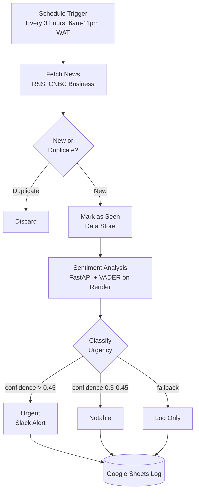
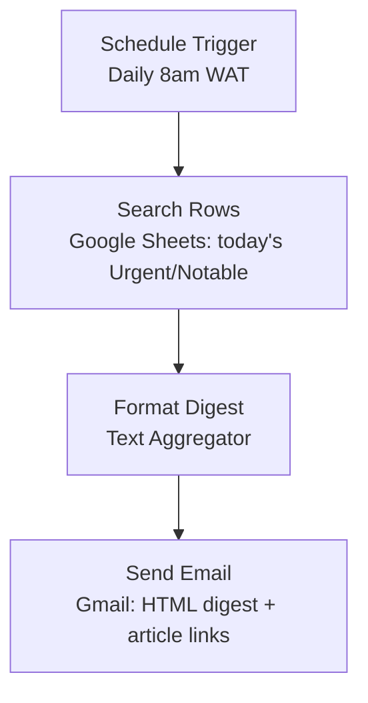

# Financial News Intelligence & Alert System

A two-scenario Make.com automation that continuously monitors financial news, scores each headline with a self-hosted NLP sentiment model, and routes it by urgency which entails instant Slack alerts for market-moving news, a clean daily email digest for everything else worth knowing.

Built to demonstrate real automation architecture which includes deduplication, external API integration, tiered conditional routing, and multi-channel delivery, rather than a single "trigger → action" flow.

## The Problem

Financial markets move on news, and reacting late has a real cost, a rate-hike headline or a merger collapse can shift markets within minutes. But no one can watch a news feed all day. Manual monitoring tends to fail in one of two directions: check too rarely and miss something that mattered while it was actionable, or check constantly and burn out on noise, since most headlines scrolling past aren't actually significant.

The result is either missed signal or alert fatigue which is rarely the right balance of "know immediately" versus "know eventually."

## How This Project Solves It

This system automates not just the monitoring, but the judgment call of what deserves immediate attention versus what can wait until later:

- Every new headline is scored for sentiment and confidence by a purpose-built model as soon as it's published
- Genuinely significant news is pushed to Slack within the same polling cycle, which means no manual checking required to catch it in time
- Everything else worth knowing, but not urgent, is queued and delivered as a single daily digest instead of fragmenting attention throughout the day
- Nothing is silently dropped, even low-signal headlines are logged, so the system stays auditable and nothing "urgent in hindsight" slips through unnoticed

The end result is a fully unattended pipeline that mirrors what a dedicated analyst watching the wire would do, but running continuously, consistently, and at effectively zero marginal cost per headline checked.

## Why two scenarios instead of one

Splitting monitoring from digest delivery keeps each piece independently testable and debuggable. The live monitor runs unattended every few hours; the briefing is a separate, simpler read-and-format job that only touches what's already been logged. If one breaks, the other keeps working.

## Architecture

### Scenario A — Continuous Monitoring

1. **Schedule trigger** polls every 3 hours during waking hours, balancing freshness against Make's free-tier operations budget
2. **RSS fetch** pulls the latest CNBC Business headlines
3. **Dedup check** against a Make Data Store: headlines already processed are discarded before they cost any further operations
4. **New headlines** get marked as seen, then sent to a self-hosted sentiment API
5. **Router** classifies each headline into Urgent / Notable / Log Only based on model confidence
6. **Urgent** headlines fire an immediate Slack alert; all three tiers get logged to Google Sheets with headline, source, sentiment, confidence, tier, and timestamp

### Scenario B — Daily Briefing

1. **Schedule trigger** fires once daily
2. **Search Rows** pulls the day's Urgent and Notable rows from the shared log
3. **Text Aggregator** formats each row into a readable line with a clickable "Read more" link back to the source article
4. **Gmail** sends the compiled digest

## Tech Stack

| Component | Tool | Why |
|---|---|---|
| Orchestration | Make.com | Visual scenario builder, native Data Store for stateful dedup |
| News source | RSS (CNBC Business) | No API key required, reliable structured feed |
| Sentiment analysis | FastAPI + VADER | Self-hosted, lightweight, avoids heavy model downloads on free hosting |
| API hosting | Render (free tier) | Zero-cost deployment for a portfolio-scale service |
| Data log | Google Sheets | Queryable, exportable, doubles as a lightweight dashboard |
| Real-time alerts | Slack | Instant push for time-sensitive news |
| Digest delivery | Gmail | Familiar, HTML-formatted daily summary |

## Key Design Decisions

- **Custom sentiment API over a bare LLM call** — VADER scoring runs through code I wrote and deployed, not just a prompt to an off-the-shelf model. Keeps the "why" of each classification inspectable and cheap to run at scale.
- **VADER over FinBERT** — FinBERT is more accurate on financial text but requires a ~400MB model download, which strains free-tier hosting memory and cold-start time. VADER trades some domain accuracy for a fast, reliable deploy. Documented as a clear upgrade path (see below).
- **Data Store dedup instead of re-processing every poll** — avoids duplicate alerts and keeps operations spend proportional to genuinely new headlines, not feed size.
- **Tiered routing instead of a single alert threshold** — avoids alert fatigue (not every headline deserves a Slack ping) while still keeping a full audit log of everything scanned.

## Setup

1. Deploy `main.py` (FastAPI + VADER) to Render or similar; note the live `/analyze` endpoint URL
2. Create a Google Sheet with columns: `Headline | Source | URL | Sentiment | Confidence | Tier | Timestamp`
3. In Make.com, build Scenario A (RSS → Data Store → sentiment HTTP call → Router → Slack/Sheets) and Scenario B (Sheets search → aggregate → Gmail) per the architecture above
4. Connect Slack and Gmail accounts within their respective modules
5. Activate both scenarios

## Challenges & Debugging Notes

- **Render free-tier cold starts** (30–60s after 15 min idle) meant early test calls appeared to fail when they'd simply timed out waking the service. Not an issue for a 3-hour polling interval in practice.
- **VADER reads financial headlines flatter than expected** — factual, unemotional phrasing (e.g. "Fed raises rates 50bps") scores lower confidence than the news significance would suggest, even for major stories. Required tuning the urgency threshold down from an initial 0.6 to 0.45 after live testing.
- **Router branch overlap** — after adjusting the Urgent threshold, the Notable branch's upper bound needed a matching update to stay mutually exclusive; caught during manual branch testing before it could double-fire alerts.
- **Make's free-tier operations budget (1,000/month)** directly shaped the polling interval — every processed headline costs ~5-6 operations across the pipeline, so frequency had to be balanced against sustainability, not just "faster is better."

## Known Limitations / Future Improvements

- Single RSS source which is straightforward to extend with additional feeds (Reuters, Bloomberg) via a parallel RSS watch + shared dedup store
- `impact_keywords` is captured by the sentiment API but not yet factored into the urgency filter — currently confidence-only
- VADER could be swapped for FinBERT once hosted on infrastructure with more memory headroom, for better domain-specific accuracy
- No retry/error-handling path yet if the sentiment API is unreachable mid-run

## Screenshots

*(Add once the system has run for a few days: Google Sheets log, a live Slack alert, and a sample daily digest email)*

---
